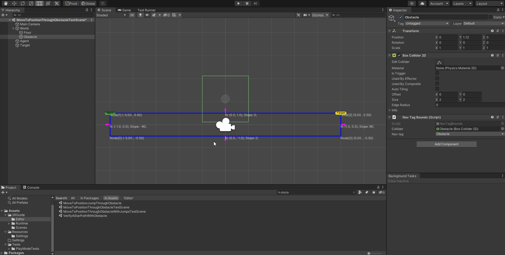
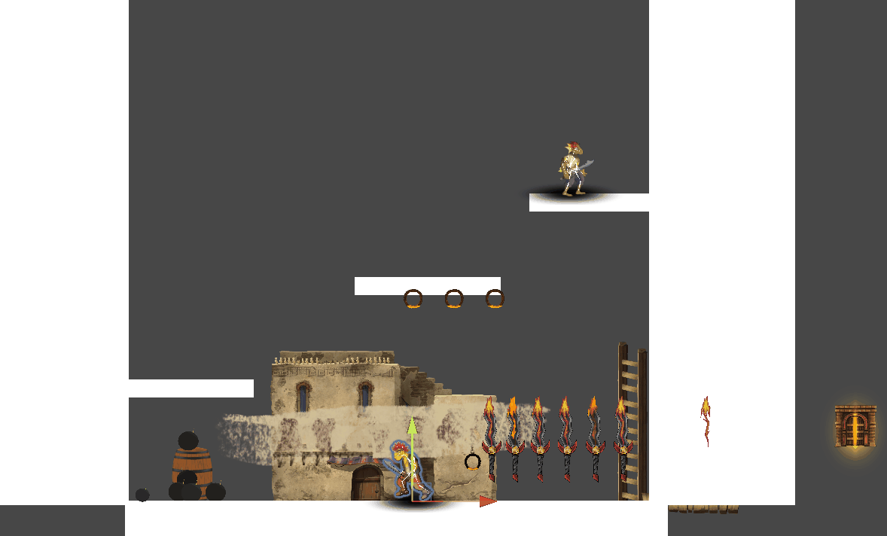

2RGuide
===
Unity3D navigation solution for 2D platformers using 2D colliders.

This is still early work in progress, it's not advised to use on a production project

Add Dependency
===
In Unity's Package Manager add package from git url with the following value:

```
https://github.com/TiagoJSM/2RGuide.git?path=Assets/2RGuide
```

Features
===
* Builds navigation paths from scene colliders 
* Agent to traverse the shortest paths to reach a target position.
* Support for auto generated jumps and drops to connect segments segments
* Support for one way platforms jumps
* Areas that forbid agent to move into to avoid obstacles

Getting Started
===
* Download the project and open it in Unity3D
* Create a parent `GameObject` to hold other GameObjects with the colliders to represent the world's paths
* Add the `NavWorld` component to the parent `GameObject`
* On the component's inspector panel press bake to generate the navigation segments
* Add `GuideAgent` component to Agent GameObject to and `TransformMovement` to move in the navigation segments, if your object requires custom movement replace `TransformMovement` with your own `MonoBehaviour` and consume the data provided by `GuideAgent`
* To tweat the bake procedure go to `Edit` > `Project Settings` > `Nav2RGuide Settings` and modify the values to your liking
* Add Obstacle component to define obstacle nav segments  

Planned Features
===
* Support for user designed jumps and drops to connect segments

Additional Debug
===
Add `TWOR_GUIDE_DEBUG` as preprocessor directive to include additional debug information in editor.

Examples
===
## Baking navigation segments:


## Add nav tags to nav segments:



## Moving to target in game:



License
===
[MIT licensed](./LICENSE)